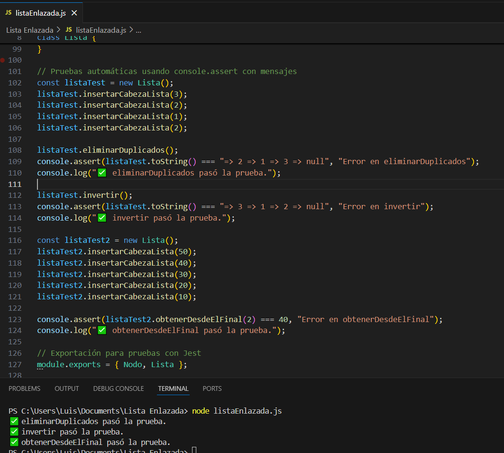

# Listas Enlazadas JS

El siguiente pryecto es una practca de listas enlazadas en la cual hemos agregado disintos metodos y funciones para ver el comportamiento de estas. Utilizando como herramienta NodeJs.

Empezaremos con los pasos a seguir para la instalacionde nodejs 

##  Descargar e instalar NodeJs

- Ir al sitio oficial de Node.js:
- Seleccionar la versión LTS (Long Term Support) para mayor estabilidad.
- Instalar Node.js siguiendo las instrucciones del asistente de instalación según tu sistema operativo (Windows, macOS o Linux).
- Cross platform

## Verificar la instalación:

- Abrir la terminal o símbolo del sistema.
- Ejecutar los siguientes comandos para comprobar que Node.js y npm se instalaron correctamente:
   - node -v         # Muestra la versión de Node.js instalada
   - npm -v         # Muestra la versión del gestor de paquetes npm instalada
- Resultado esperado: Deberías ver la versión instalada (por ejemplo, v18.17.0 para Node.js y algo similar para npm).

## Configuración del Archivo listaEnlazada.js:

- Descargar y guardar el archivo en una carpeta de tu preferencia, por ejemplo, Documentos/NodeJS/.
- Abre la terminal y navega hasta la carpeta donde guardaste el archivo:
    - cd ruta/a/la/carpeta/NodeJS/

- Ejecuta el script: node listaEnlazada.js

## Screenshots

